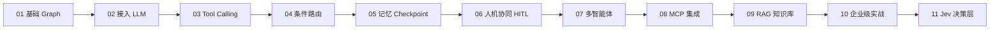

<div align="center">

# LangGraph Pro

**基于 LangGraph 的渐进式 AI Agent 学习示例集**

从第一个 Hello Graph，到工具调用、记忆、人机协同、多智能体、MCP、RAG，直至企业级综合实战 —— 11 个由浅入深的可运行示例。


</div>

---

## 📖 项目简介

本项目是一套 **LangGraph 学习路线图**，每个 Demo 聚焦一个核心概念，代码中带有详细的中文注释，可独立运行。所有示例均通过 OpenAI 兼容接口调用大模型，可无缝对接 OpenAI、DeepSeek、Qwen、GLM 等任意兼容服务。

按顺序学完，你将掌握构建生产级 AI Agent 所需的全部核心能力：

- ✅ Graph / State / Node / Edge 核心模型
- ✅ LLM 接入与 Tool Calling（ReAct 循环）
- ✅ 条件路由与分支控制
- ✅ Checkpoint 记忆与多用户会话隔离
- ✅ Human-in-the-Loop 人工审批
- ✅ Supervisor 多智能体协作
- ✅ MCP 协议集成（Server + Client）
- ✅ RAG 知识库增强
- ✅ 企业级综合 Agent 架构

## 🗺️ 示例一览

| # | 文件 | 主题 | 核心知识点 |
|---|------|------|-----------|
| 01 | [demo01_basic.py](demo01_basic.py) | 第一个 Graph | `StateGraph`、Node、Edge、compile、invoke |
| 02 | [demo02_llm.py](demo02_llm.py) | 在 Graph 中接入 LLM | `ChatOpenAI`、`add_messages`、消息状态 |
| 03 | [demo03_tool_agent.py](demo03_tool_agent.py) | 工具调用 Agent | `@tool`、`bind_tools`、`ToolNode`、条件边、ReAct 循环 |
| 04 | [demo04_router.py](demo04_router.py) | 条件路由 | Router 模式、意图分发、分支节点 |
| 05 | [demo05_memory.py](demo05_memory.py) | 对话记忆 | `InMemorySaver`、Checkpoint、`thread_id` 多用户隔离 |
| 06 | [demo06_human_loop.py](demo06_human_loop.py) | 人机协同 | `interrupt`、`Command`、报销审批流 |
| 07 | [demo07_multi_agent.py](demo07_multi_agent.py) | 多智能体协作 | Supervisor 模式、任务分派、Agent 间交接 |
| 08 | [demo08_mcp_server.py](demo08_mcp_server.py) | MCP Server | `FastMCP`、stdio 传输、工具暴露 |
| 08 | [demo08_mcp_agent.py](demo08_mcp_agent.py) | MCP Agent | `MultiServerMCPClient`、`create_react_agent`、异步调用 |
| 09 | [demo09_rag_agent.py](demo09_rag_agent.py) | RAG 知识库问答 | 文档加载、文本切分、`HuggingFaceEmbeddings`、`Chroma` 向量检索 |
| 10 | [demo10_enterprise_agent.py](demo10_enterprise_agent.py) | 🏆 企业级综合实战 | Multi-Agent + RAG + Tool Calling + 并行执行 + HITL + Checkpoint |
| 11 | [demo11_jev_agent.py](demo11_jev_agent.py) | Jev 智能决策层 | `typesafe-sdk`（Choice / Noul）、置信度路由、Jev + LLM 协同 |

## 🚀 快速开始

### 环境要求

- Python **3.10+**
- [uv](https://docs.astral.sh/uv/) 包管理器

### 安装依赖

```bash
git clone https://github.com/MicroMirror/langgraph-pro.git
cd langgraph-pro
uv sync
```

### 配置环境变量

复制并填写 `.env`：

```dotenv
# OpenAI 兼容接口（支持 OpenAI / DeepSeek / Qwen / GLM 等）
OPENAI_API_KEY=your-api-key
OPENAI_BASE_URL=https://api.openai.com/v1
OPENAI_MODEL=gpt-4o

# 仅 demo11 需要
TYPESAFE_API_KEY=your-typesafe-api-key
```

> ⚠️ `.env` 含密钥，请勿提交到仓库（已在 `.gitignore` 中排除）。

### 运行示例

```bash
uv run python demo01_basic.py
uv run python demo03_tool_agent.py

# MCP 示例需先启动 Server（demo08_mcp_agent 会自动拉起）
uv run python demo08_mcp_agent.py

# RAG 示例会读取 docs/ 下的 Markdown 作为知识库
uv run python demo09_rag_agent.py
```

## 📚 学习路线



## 📂 项目结构

```
langgraph-pro/
├── demo01_basic.py             # 第一个 StateGraph
├── demo02_llm.py               # Graph 中接入 LLM
├── demo03_tool_agent.py        # 工具调用 Agent
├── demo04_router.py            # 条件路由 / Router
├── demo05_memory.py            # Checkpoint 记忆
├── demo06_human_loop.py        # Human-in-the-Loop
├── demo07_multi_agent.py       # Supervisor 多智能体
├── demo08_mcp_server.py        # MCP Server（FastMCP）
├── demo08_mcp_agent.py         # MCP Client + ReAct Agent
├── demo09_rag_agent.py         # RAG 知识库 Agent
├── demo10_enterprise_agent.py  # 企业级综合实战
├── demo11_jev_agent.py         # Jev 决策层 + LangGraph
├── docs/                       # RAG 示例语料（企业知识库文档）
│   ├── product.md
│   ├── company.md
│   └── ai_strategy.md
├── chroma_db/                  # 向量库持久化目录（demo09 生成）
└── pyproject.toml
```

## 🧱 技术栈

| 组件 | 说明 |
|------|------|
| [LangGraph](https://github.com/langchain-ai/langgraph) | Agent 编排框架（StateGraph / Checkpoint / interrupt） |
| [LangChain](https://github.com/langchain-ai/langchain) | LLM 接入、工具、文档处理 |
| [Chroma](https://github.com/chroma-core/chroma) + [Sentence-Transformers](https://github.com/UKPLab/sentence-transformers) | 向量数据库与本地 Embedding |
| [MCP](https://github.com/modelcontextprotocol) | Model Context Protocol 工具服务 |
| [uv](https://docs.astral.sh/uv/) | 极速 Python 包管理与虚拟环境 |

## 🤝 贡献

欢迎提交 Issue 和 Pull Request！如果你希望补充新的示例（如 Streaming、Subgraph、LangGraph Platform 部署等），请随时发起讨论。

---

<div align="center">

**如果这个项目对你有帮助，欢迎点个 Star ⭐**

</div>
